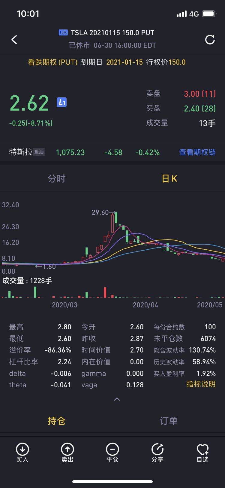



## 缘起

最初几年在美股，我是加杠杆的。我tesla平均买入价300左右，跌破220的时候，我的正股就被迫平仓了。后来进一步跌到180，我的期权也被迫挪仓。时间是2019年5月底，我当时决定卖出最长时限的期权，一年半以后到期,行权价150。我觉得tesla就算破产被收购也值这个价。卖出的价格是21.87

## 一度想平仓
今年年初，这个期权的价格只有1块多了。当时一度想平仓，因为期权高手都是盈利90%以上一定平仓。后来还是算了，这个期权怎么看也是挣钱的。

## 市场恐慌

谁知今年三月份，市场整体恐慌的情况下，这个期权的价格居然涨到了29块。在特斯拉股价500，时间只有一半的情况下。期权的价格居然高于我当初卖出时。

尝试过杠杆后，我就尽量避免杠杆了。所以如果是卖PUT期权，我会考虑如果期权砸到手里，我的资金是否够，杠杆是否过高。这样来看，一手期权，看起来没占用多少保证金，其实占用了对应的正股的资金。

这个期权的暴跌，直接限制了我恐慌时期的加仓能力。其实当时很想追加卖一手PUT，但是算算砸到手上的话，资本金不够，所以还是算了。

## 半年后

现在时间又过去了一半，股价又涨了一倍的情况下。这个期权的价格仍高于半年前。

## 总结
结论就是期权其实是赌博，不能以价值投资、长期持有的观点来看。不想加杠杆，就不碰期权。长期持仓，那就拿正股。

